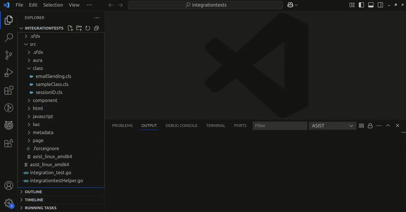
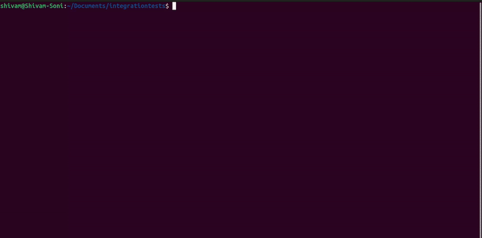
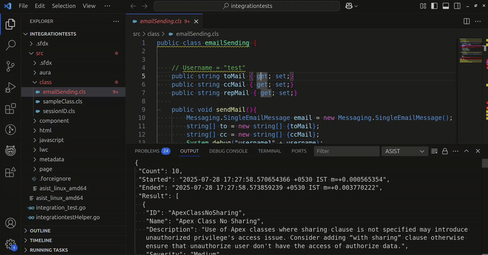

<div align="center">
</img>
</div>

# ASIST (Automated Security Issue Scanning Tool)
[](https://pkg.go.dev/github.com/certinia/asist)
[](https://opensource.org/license/bsd-3-clause)

ASIST is a regex-based, blazing-fast Static Application Security Testing (SAST) tool for securing Salesforce apps at developer speed. 

Originally built for internal use at Certinia to support Security Reviews, we have now decided to release it to the community 🌍

## ⭐ Features

- ⚡ Fast! Scan a single file in tens of milliseconds, and under a minute to scan a project with 2.5M lines of Apex code
- 👾 32 rules covering XSS, Sharing clauses, hardcoded secrets, and some more obscure pitfalls, all aligned with Salesforce security best practices
- 🖋️ Supports custom regex rules in config and standard rule overrides
- ✅ False positive management with comments or annotations
- ⚙️ VSCode extension for scanning as you code! See the [extension README](extension/README.md) for more details
- 💻 Multi-platform, multi-architecture (tested on Mac Intel, Mac Silicon, Windows, and Linux)
- 🚫 Respects .gitignore and .forceignore by default
- 🧩 YAML or JSON config, and JSON output for programmatic processing 😎
- 🏗️ CI/CD-ready without the disruption
- 📈 Baseline scan mode for generating metrics

## ▶️ VSCode extension demo

 

## ▶️ CLI demo



## 📥 Installing

### Precompiled releases

1. Download the binary of your choice from [releases](https://github.com/certinia/asist/releases).
2. Place the binary somewhere in your PATH

### As a Go package

1. Run `go install github.com/certinia/asist`

### Installing the VSCode extension

Search for ASIST on the VSCode marketplace.

See [extensions](extension) for usage

### Build from source

1. Install `go` and `make`
2. Clone this repo
3. Install into your GOPATH: `make install`

Alternatively:

- To just build the binary for your OS and architecture: `make`
- To cross-compile: `GOOS=windows GOARCH=amd64 go build -o asist.exe .`
- To build binaries for the most common platforms, run: `make build-binaries`
 

## 🕹️ Usage

To see the help, run:
`asist -h`

```text
Usage:
  asist [OPTIONS] [Path]

Application Options:
  -u, --repo-url=      URL of the repo. Used for baseline scan output
  -c, --config=        JSON or YAML config file to read from
  -r, --rules=         Rules comma separated to run (ignore rules enabled/disabled in config)
  -l, --list-rules     List rules which would be run
  -b, --baseline-scan  For getting output of ASIST baseline scan as count of occurrences and false positive occurrences, number of custom rules occurrences, type of record and this data is used for creating
                       metrics.
  -j, --cicd-rules     For use in CI/CD pipelines. Tells ASIST to only run the CICD rules defined in config file. If there are no CI/CD rules defined, no rules will be executed. If there are any occurrences, returns
                       a non-zero exit code which will make the pipeline step fail
  -v, --verbose        Print out debug messages with time elapsed since last message
  -V, --version        Display the current version of ASIST binary

Help Options:
  -h, --help           Show this help message

Arguments:
  Path:                Path to the file or folder to scan
```

### 🧩 Examples

Recursively scan the current working directory with default settings (all rules):

```shell
asist .
```

This scan produces the following output, indicating the total number of issues identified, the start and end timestamps, and the detailed findings:

```json
{
 "Count": 161,
 "Started": "2025-07-23 13:12:08.231779 +0200 CEST m=+0.000501126",
 "Ended": "2025-07-23 13:12:08.307712 +0200 CEST m=+0.076432459",
 "Result": [
  {
   "ID": "ApexClassNoSharing",
   "Name": "Apex Class No Sharing",
   "Description": "Use of Apex classes where the sharing clause is not specified may cause confusion for other developers. Always set the most restrictive sharing clause for each class.",
   "Severity": "Medium",
   "RuleCategory": "Security",
   "Occurrence": {
    "File": "/Users/shaundoyle/sandbox/product/asist/files/testData/testFile.cls",
    "Line": "Class TestFile {",
    "LineNumber": 1,
    "ColumnRange": [
     0,
     14
    ]
   }
  },
  {
   "ID": "XSSFormAction",
   "Name": "Potential XSS with formaction in JS context",
   "Description": "Use of the formaction attribute in JavaScript context may introduce an XSS issue. Consider removing it, otherwise ensure that no user input is rendered unescaped.",
   "Severity": "High",
   "RuleCategory": "Security",
   "Occurrence": {
    "File": "/Users/shaundoyle/sandbox/product/asist/integrationtests/src/aura/aura.cmp",
    "Line": "    \u003cform id=\"test\"\u003e\u003c/form\u003e\u003cbutton form=\"test\" formaction=\"javascript:alert(1)\"\u003eX\u003c/button\u003e",
    "LineNumber": 3,
    "ColumnRange": [
     47,
     70
    ]
   }
  },
  [...]
```

Scan a single file with default settings:

```shell
asist force-app/main/default/classes/MyClass.cls
```

Print the ASIST version

```shell
asist -V
```

Scan a file with your config:

```shell
asist -c ./.asist.json force-app/main/default/classes/MyClass.cls
```

Scan with a single rule:

```shell
/asist -r ApexClassNoSharing .
```

Just list enabled rules, but don't scan:

```shell
asist -l
asist -c .asist.yaml -l # Does not list rules disabled in your config
```

Run in verbose mode (for debugging):

```shell
asist -v .
```

Run in CI/CD mode (will only run rules added to `cicdrules` if this property is defined):

```shell
asist -j .
```

Run in baseline mode:

```shell
asist -b -u "https://github.com/certinia/asist.git" .
```

## ⚙️ Configuration

Most of the configuration required for your project will be defined in a configuration file.

ASIST supports YAML or JSON config files.

When scanning a folder, ASIST will automatically detect either `.asist.yaml` or `.asist.json` from the top-level folder being scanned.

Configuration files can also be explicitly specified using the `-c` argument (note that this is required when scanning a single file).

Within the config file, you can:

* Enable/disable all the standard rules  
* Override certain properties of standard rules
* Exclude files or directories for all rules
* Exclude files or directories for specific rules
* Add custom regex rules
* Define rules to be run in CI/CD mode

See our [example config file](.asist.example.yaml) for a walkthrough of all config options.

### 🔧 Customizing Standard rules

Users can override certain properties of standard rules according to their needs, allowing them to customize the behavior of specific rules by:

- Disabling rules entirely: `enabled`
- Tweaking rule severity: `severity`
- Tweaking what files should be scanned: `includepattern`
- Tweaking what files should not be scanned: `excludepattern`

### ✍🏼 Creating Custom Rules

In addition to customizing standard rules, users can also create custom rules to define their own regex pattern:

```yaml
customregexrules:
  NoDebugStatements:
    name: doNotDebug
    description: "Debug statements anticipate bugs; avoid bugs instead"
    enabled: false
    severity: Critical
    rulecategory: Security
    pattern: "System\\.debug\\("
    includepattern: "\\.cls$"
    excludepattern: "Test\\.cls$"
```

You can test this specific rule like this:


```shell
asist -c .asist.yaml -r doNotDebug <file>
```

## ❌ False positive management

ASIST provides the ability to mark false positives with annotations, comments, or any other places where arbitrary text can be specified.

In the example below, the `SessionIDApex` rule is ignored for the statement:

```java
// asist-ignore-begin:[SessionIDApex]
ID sid = UserInfo.getSessionID();
// asist-ignore-end
```

Various rule IDs may be comma-separated to ignore multiple rules for a particular block of code, and comments with justifications can be set after the `asist-ignore-begin` statement:

```java
// asist-ignore-begin:[SessionIDApex,InsecureCryptoAlgorithm] This code is for testing, and not part of the package
ID sid = UserInfo.getSessionID();
Blob sidBlob = Blob.valueOf(sid);
Blob hash = Crypto.generateDigest('MD5', sidBlob);
[...]
// asist-ignore-end
```

In markup languages, comments should be set in `<!-- comments -->` when possible.

In any other file types, the user must figure out the more appropriate way to insert the `asist-ignore-begin` and `asist-ignore-end` statements. Technically, it doesn't matter where you put them!

_**Note**: Nested false positive tags are not supported._

### 🔌 Using the Extension to mark false positives

While using ASIST Extension, hover over the occurrence and click on `Quick fix...` option, and select `Mark False positive`:

  

# 🔁 CI/CD mode

CI/CD mode is enabled using the `-j` flag:

```shell
asist -j .
```

In this mode, by default, all enabled runs will be run if `cicdrules` property is not defined, but if the `cicdrules` config property contains any rule IDs, only these will be run. And, if `cicdrules` is defined but is blank (no rule is mentioned under this property), then no rules will be executed.

```yaml
cicdrules: 
  - "XSSLabel"
  - "XSSMergeField"
```

This allows developers to add a subset of the overall ruleset to ASIST to their CI/CD pipelines, and gradually add more rules to CI/CD as they start clearing out findings for other rules. This prevents any issues for rules defined in `cicdrules` from creeping back into the codebase.

### 📊 Baseline scans

This mode is intended for SecOps teams to create benchmarks across multiple projects and measure the adoption of ASIST.

Some overrides in config, such as severity, will be ignored to normalize data for apples-to-apples comparison between different code bases, and false positive findings will be included in the output.

Baseline mode is enabled by means of the `-b` flag.

It's also recommended to specify a repository URL with the `-u` flag:

```shell
asist -b -u "git@github.com:certinia/asist.git" .
```

This command will output a JSON like this (when formatted):

```json
[
	{
		"RepositoryName": "certinia/asist",
		"RepositoryURL": "git@github.com:certinia/asist.git",
		"RecordType": "Finding",
		"Content": {
			"FindingID": "b17fe249915712219aca7e",
			"IsCustom": false,
			"IsFalsePositive": true,
			"RuleID": "LwcNonStandardPositioning",
			"Severity": "Medium",
			"RuleCategory": "Security"
		}
	},
	{
		"RepositoryName": "certinia/asist",
		"RepositoryURL": "git@github.com:certinia/asist.git",
		"RecordType": "Finding",
		"Content": {
			"FindingID": "3a2861bee641864816b86d",
			"IsCustom": false,
			"IsFalsePositive": true,
			"RuleID": "LwcNonStandardPositioning",
			"Severity": "Medium",
			"RuleCategory": "Security"
		}
	}
]
```

A few differences can be observed compared to regular scans:

- Most of the "human-friendly" information is missing (e.g., the code location of the finding, the finding description, etc.)
- The repository name and URL will be included so that metrics systems can use this as a dimension for filtering.
- Each issue is assigned a `FindingID`, which is effectively a hash that uniquely identifies the finding based on the rule, the finding location, and if it's a false positive or not.
- A few more properties are added, such as if the rule is custom, or if the finding is marked as false positive or not.


### 🫣 .gitignore and .forceignore files

By default, ASIST will ignore files and folders defined inside .gitignore and .forceignore. If you don't want ASIST to respect .gitignore and .forceignore, you can use the following properties in the config file:

- **dontgitignore**
- **dontforceignore**

### ⍈ Exit Codes

| Exit code | Exit Reason                                              |
| --------- | -------------------------------------------------------- |
| 0         | ASIST executed successfully with no findings             |
| 1         | ASIST executed successfully with findings                |
| 3         | ASIST failed due to internal error (file a bug report!)  |
| 4         | ASIST failed due to user error (review input and config) |


## 🏗️ [CONTRIBUTING](CONTRIBUTING.md)

## 🎫 [LICENSE](LICENSE.txt)

## ❤️ Contributors

A big thank you to everyone who has contributed to ASIST!

<table>
  <tr>
  <td align="center">
      <a href="https://github.com/sdoylecertinia">
        <br />
        <sub><b>Shaun</b></sub>
      </a>
  </td>
  <td align="center">
      <a href="https://github.com/pjaincertinia2025">
        <br />
        <sub><b>Pragati</b></sub>
      </a>
    </td>
    <td align="center">
      <a href="https://github.com/gkumarcertinia">
        <br />
        <sub><b>Govardhan</b></sub>
      </a>
    </td>
  <td align="center">
      <a href="https://github.com/hdaulani">
        <br />
        <sub><b>Hemant</b></sub>
      </a>
    </td>
    <td align="center">
      <a href="https://github.com/adawercertinia">
        <br />
        <sub><b>Abhishek</b></sub>
      </a>
    </td>
  <td align="center">
      <a href="https://github.com/dsinghcertinia">
        <br />
        <sub><b>Dheeraj</b></sub>
      </a>
    </td>
  <td align="center">
      <a href="https://github.com/ssonicertinia">
        <br />
        <sub><b>Shivam</b></sub>
      </a>
    </td>
    <td align="center">
      <a href="https://github.com/ajaincertinia">
        <br />
        <sub><b>Anant</b></sub>
      </a>
    </td>
    <td align="center">
      <a href="https://github.com/sgulyanicertinia">
        <br />
        <sub><b>Saijal</b></sub>
      </a>
    </td>
  </tr>
  <tr>
  <td align="center">
      <a href="https://github.com/pswamicertinia">
        <br />
        <sub><b>Pawan</b></sub>
      </a>
    </td>
  <td align="center">
      <a href="https://github.com/nbhatiacertinia">
        <br />
        <sub><b>Nikhil</b></sub>
      </a>
    </td>
    <td align="center">
      <a href="https://github.com/manojkumar2019">
        <br />
        <sub><b>Manoj</b></sub>
      </a>
    </td>
    <td align="center">
      <a href="https://github.com/B1naryVision">
        <br />
        <sub><b>Hal</b></sub>
      </a>
    </td>
    <td align="center">
      <a href="https://github.com/mamorriscertinia">
        <br />
        <sub><b>Matthew</b></sub>
      </a>
    </td>
  </tr>
</table>